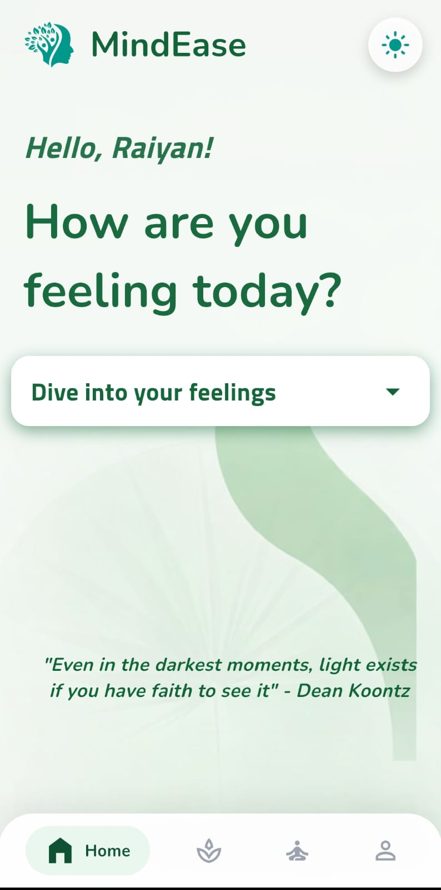
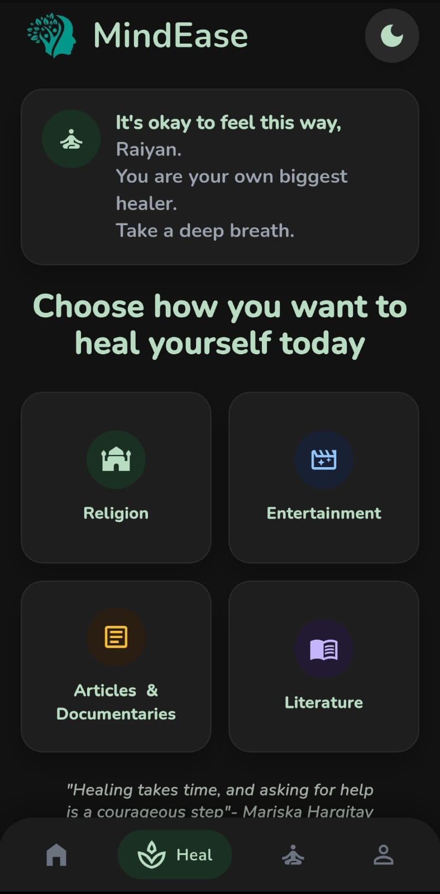
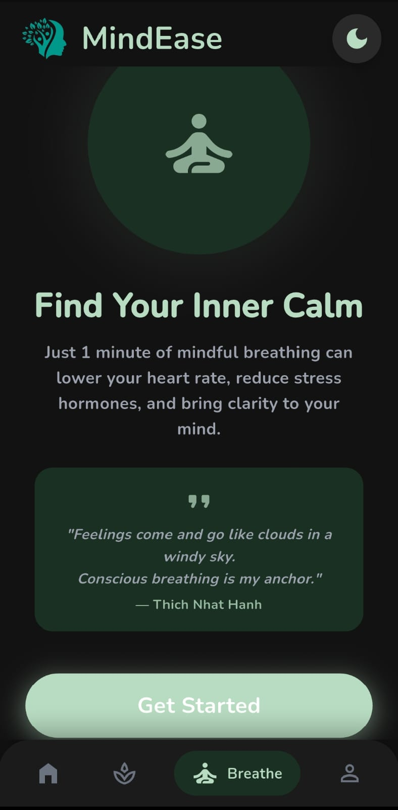

# 🌿 MindEase

> **Find Your Calm** — a Flutter-based wellness companion designed to help users discover simple, personalized ways to relax and reset.

## 📱 Overview

MindEase is a mobile application that lets users select how they are feeling and explore suitable calming content. Users can choose a mood such as **sad, anxious, stressed, or calm**, then select a preferred healing method such as entertainment, spiritual/religious content, poetry, or stories.

The app also includes authentication, cloud-backed data storage, a breathing exercise, and a clean light/dark themed interface.

## 📸 Screenshot

 
 
 

## ✨ Key Features

- 🧠 Mood-based content discovery
- 🌬️ Guided breathing exercise/timer
- 🔐 Firebase authentication
- ☁️ Cloud Firestore integration
- 🎭 Multiple healing/content categories
- 🌓 Light and dark themes
- 🎨 Custom fonts and branded UI
- 🔗 External content links
- 📱 Responsive Flutter mobile UI

## 🛠️ Technology Stack


## 📦 Dependencies

- `firebase_core`
- `firebase_auth`
- `cloud_firestore`
- `url_launcher`
- `cupertino_icons`
- `flutter_lints`
- `flutter_launcher_icons`

The project targets Dart SDK `^3.10.4`.

## 🚀 Run Locally

### Prerequisites

- Flutter SDK installed
- Dart SDK compatible with the project's environment
- Android Studio / VS Code with Flutter support
- A configured Firebase project

### Setup

```bash
git clone https://github.com/raiyan-noob/MindEase.git
cd MindEase
flutter pub get
flutter run
```

For a new Firebase setup, add the appropriate Firebase configuration files for your target platform before running the application.

## 📂 Project Highlights

The project includes custom visual assets, branded fonts, login/signup screens, mood/content backgrounds, and launcher-icon configuration.

## 🔗 Links

- **Repository:** https://github.com/raiyan-noob/MindEase

---

⭐ If you find the project interesting, consider starring the repository!
